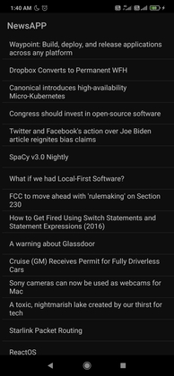

A responsive app built using android studio which uses Hackernews api to fetch top 20 tech news from the server and displays it on a list view.

Hackernews API is an open source github repository which we can use to fetch news from different categories
Hackernews API:https://github.com/HackerNews/API

A single click on an item  will bring up a new activity which has a webview displaying the contents of the url fetched from the server

A long click on an item will bring up an intent which allows us to share the url link to our peers using whatsapp,telegram and every other app that supports textfiles

